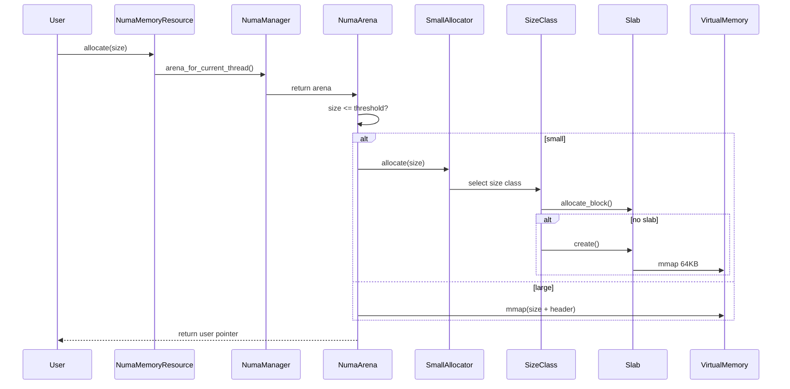

```mermaid
sequenceDiagram
    participant User
    participant PMR as NumaMemoryResource
    participant Manager as NumaManager
    participant Arena as NumaArena
    participant Small as SmallAllocator
    participant SC as SizeClass
    participant Slab
    participant VM as VirtualMemory

    User->>PMR: allocate(size)
    PMR->>Manager: arena_for_current_thread()
    Manager->>Arena: return arena

    Arena->>Arena: size <= threshold?

    alt small
        Arena->>Small: allocate(size)
        Small->>SC: select size class
        SC->>Slab: allocate_block()
        alt no slab
            SC->>Slab: create()
            Slab->>VM: mmap 64KB
        end
    else large
        Arena->>VM: mmap(size + header)
    end

    Arena-->>User: return user pointer
```