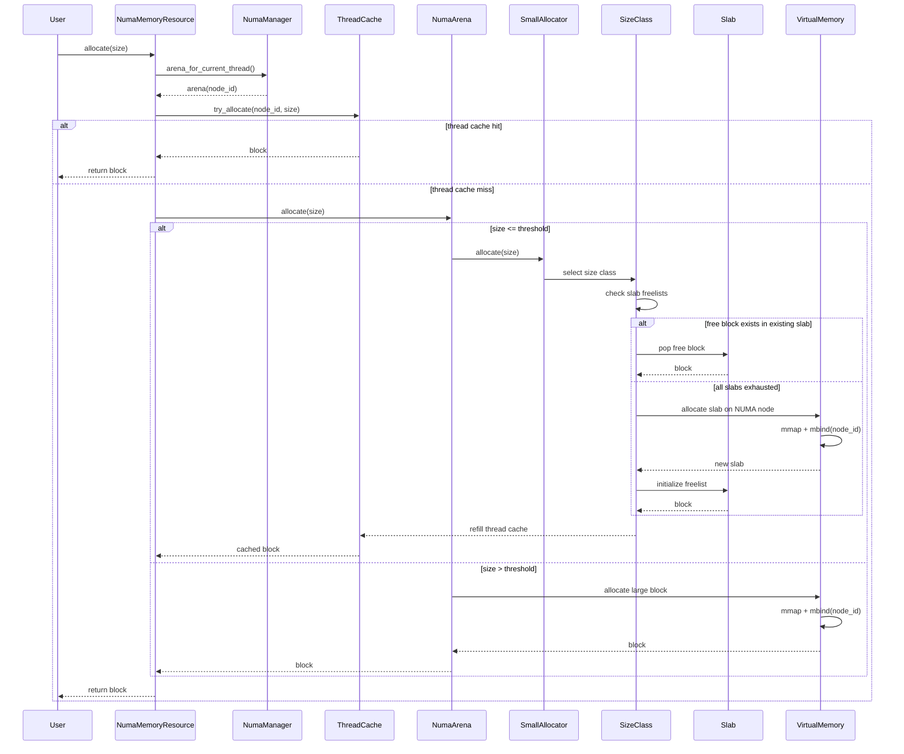

```mermaid
sequenceDiagram
    participant User
    participant PMR as NumaMemoryResource
    participant Manager as NumaManager
    participant TLC as ThreadCache
    participant Arena as NumaArena
    participant Small as SmallAllocator
    participant SC as SizeClass
    participant Slab
    participant VM as VirtualMemory

    User->>PMR: allocate(size)

    PMR->>Manager: arena_for_current_thread()
    Manager-->>PMR: arena(node_id)

    PMR->>TLC: try_allocate(node_id, size)

    alt thread cache hit

        TLC-->>PMR: block
        PMR-->>User: return block

    else thread cache miss

        PMR->>Arena: allocate(size)

        alt size <= threshold

            Arena->>Small: allocate(size)

            Small->>SC: select size class

            SC->>SC: check slab freelists

            alt free block exists in existing slab

                SC->>Slab: pop free block
                Slab-->>SC: block

            else all slabs exhausted

                SC->>VM: allocate slab on NUMA node
                VM->>VM: mmap + mbind(node_id)

                VM-->>SC: new slab

                SC->>Slab: initialize freelist
                Slab-->>SC: block

            end

            SC-->>TLC: refill thread cache
            TLC-->>PMR: cached block

        else size > threshold

            Arena->>VM: allocate large block
            VM->>VM: mmap + mbind(node_id)

            VM-->>Arena: block

            Arena-->>PMR: block

        end

        PMR-->>User: return block

    end
```