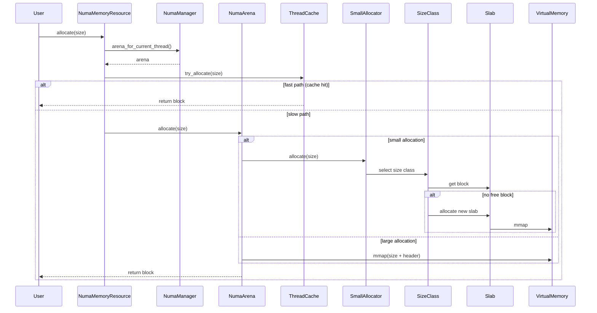

```mermaid
sequenceDiagram
    participant User
    participant PMR as NumaMemoryResource
    participant Manager as NumaManager
    participant Arena as NumaArena
    participant TLC as ThreadCache
    participant Small as SmallAllocator
    participant SC as SizeClass
    participant Slab
    participant VM as VirtualMemory

    User->>PMR: allocate(size)

    PMR->>Manager: arena_for_current_thread()
    Manager-->>PMR: arena

    PMR->>TLC: try_allocate(size)

    alt fast path (cache hit)
        TLC-->>User: return block
    else slow path
        PMR->>Arena: allocate(size)

        alt small allocation
            Arena->>Small: allocate(size)
            Small->>SC: select size class
            SC->>Slab: get block

            alt no free block
                SC->>Slab: allocate new slab
                Slab->>VM: mmap
            end

        else large allocation
            Arena->>VM: mmap(size + header)
        end

        Arena-->>User: return block
    end
```