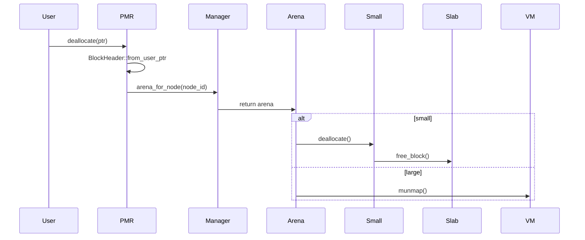

```mermaid
sequenceDiagram
    participant User
    participant PMR
    participant Manager
    participant Arena
    participant Small
    participant Slab
    participant VM

    User->>PMR: deallocate(ptr)
    PMR->>PMR: BlockHeader::from_user_ptr
    PMR->>Manager: arena_for_node(node_id)
    Manager->>Arena: return arena

    alt small
        Arena->>Small: deallocate()
        Small->>Slab: free_block()
    else large
        Arena->>VM: munmap()
    end
```