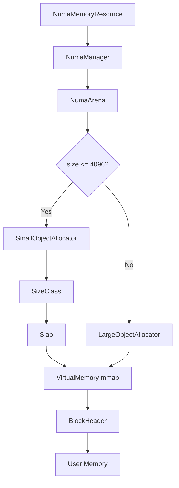

```mermaid
flowchart TD
    A[NumaMemoryResource] --> B[NumaManager]
    B --> C[NumaArena]

    C --> D{size <= 4096?}

    D -- Yes --> E[SmallObjectAllocator]
    D -- No --> F[LargeObjectAllocator]

    E --> G[SizeClass]
    G --> H[Slab]

    H --> I[VirtualMemory mmap]

    F --> I

    I --> J[BlockHeader]
    J --> K[User Memory]
```