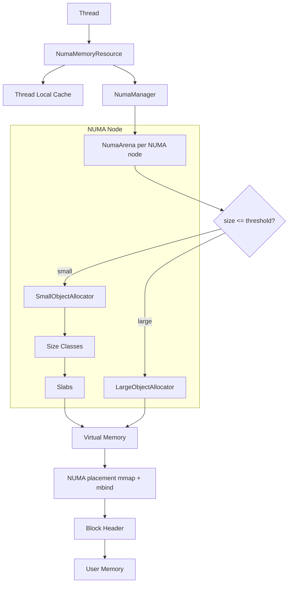

```mermaid
flowchart TD

    T[Thread]

    T --> PMR[NumaMemoryResource]

    PMR --> TLC[Thread Local Cache]

    PMR --> NM[NumaManager]

    NM --> NA[NumaArena per NUMA node]

    NA --> DEC{size <= threshold?}

    DEC -- small --> SOA[SmallObjectAllocator]
    DEC -- large --> LOA[LargeObjectAllocator]

    SOA --> SC[Size Classes]
    SC --> SL[Slabs]

    SL --> VM[Virtual Memory]
    LOA --> VM

    VM --> NUMA[NUMA placement mmap + mbind]

    NUMA --> BH[Block Header]
    BH --> UM[User Memory]

    subgraph NUMA Node
        NA
        SOA
        SC
        SL
        LOA
    end
```